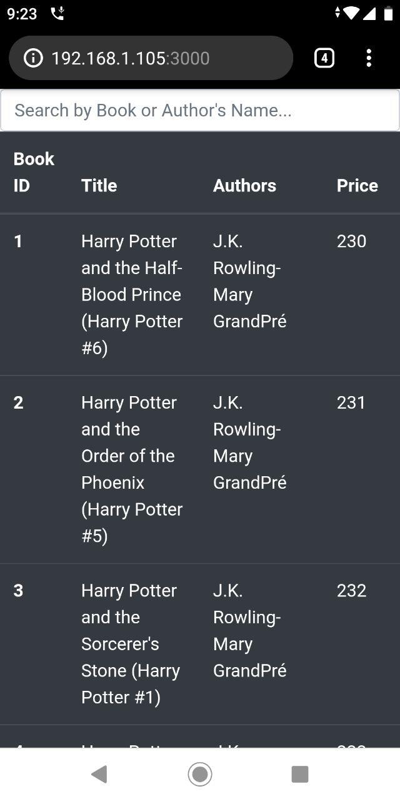
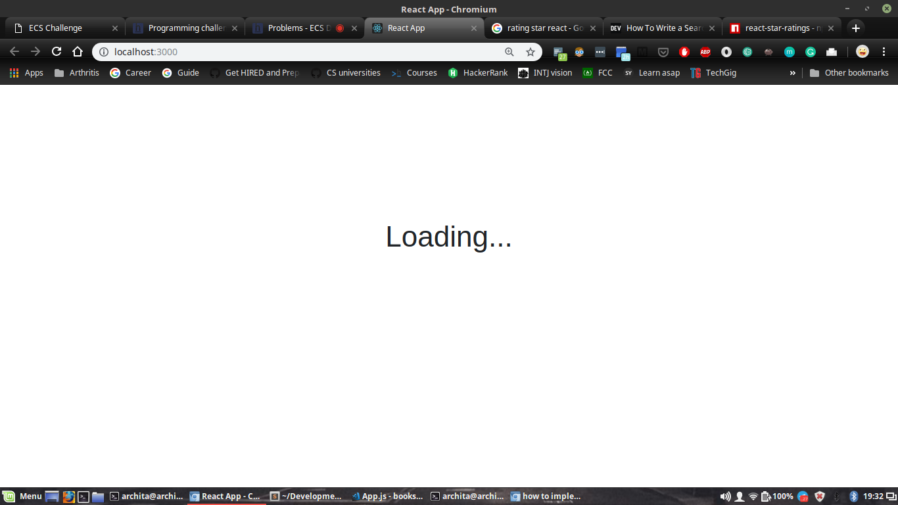
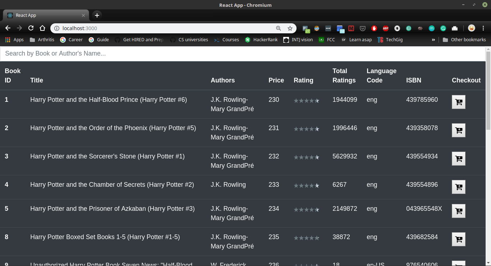

# Books' App

All-in-one place to Browse, Search & Buy books conveniently.

## Installation Instructions
- After unzipping (or cloning) the repository, go inside the directory containing the project.
    - ` cd books-app-react `
- Install all the dependencies:
    - `npm install`
- To run the app, run following command:
    - `npm start`

## Features Implemented
- Fetched the books data from API
    - Used a CORS-anywhere API to overcome cross-site origin error when fetching data from the API
- The books are displayed as a sorted list (sorted by books' ID)
- Ratings of books are displayed in the format

## Tech Stack
- ReactJS 
    - Framework used to create the whole app
- Bootstrap 4
    - To make the app responsive
- CORS-anywhere API
    - To overcome cross-site origin error when fetching data from API
- StarRatings 
    - Node Module, to display ratings in star format

## Screenshots

