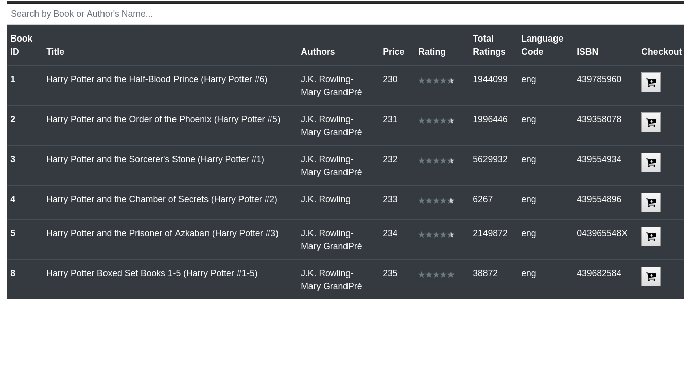
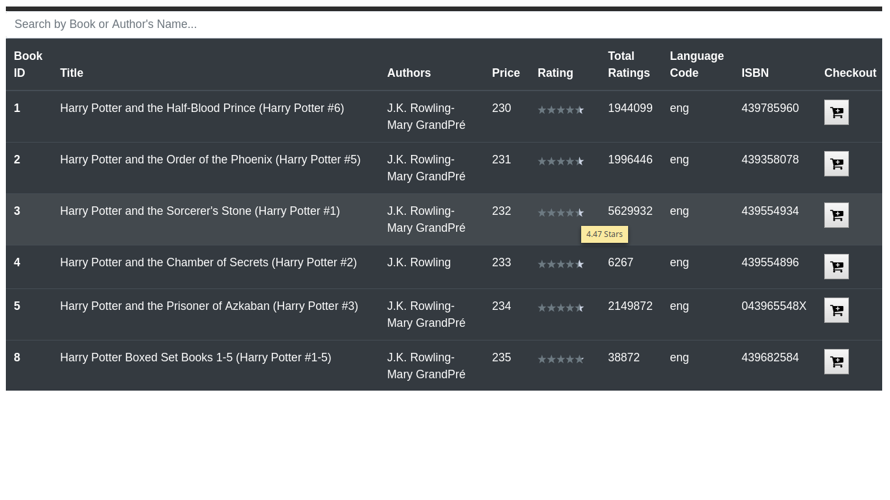
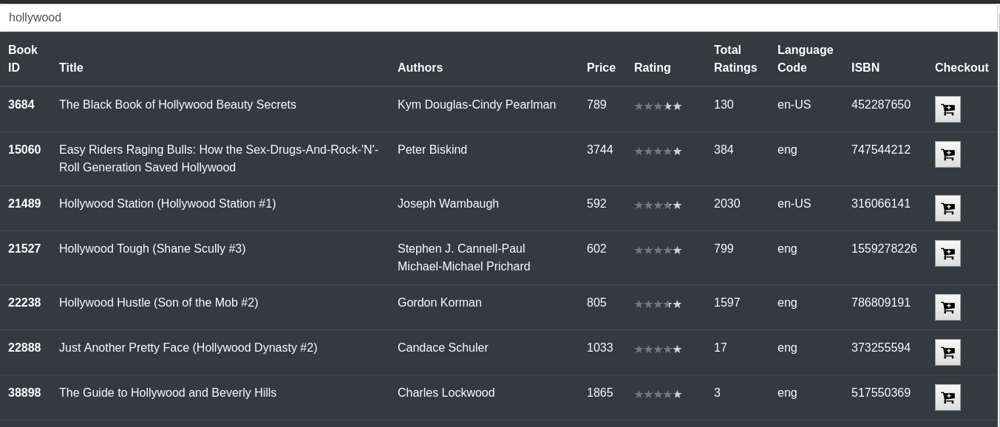
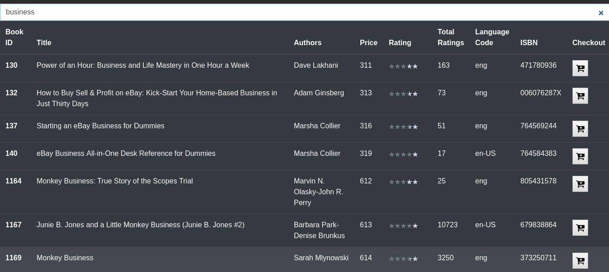
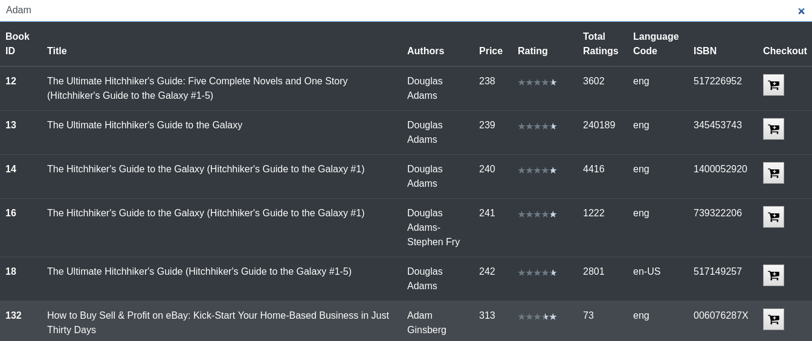
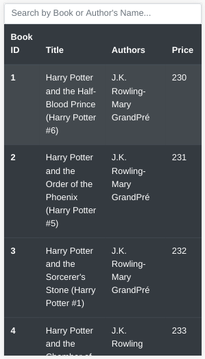
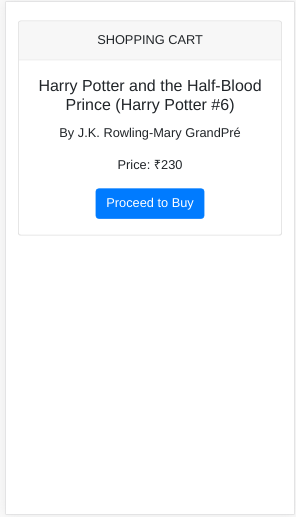

# Books' App

All-in-one place to Browse, Search & Buy books conveniently.

## Installation Instructions
- After unzipping (or cloning) the repository, go inside the directory containing the project.
- Note: You can clone the repository from following URL:
    - `git clone https://github.com/ArchitaDesai/books-app-react`
    - ` cd books-app-react `
- Install all the dependencies:
    - `npm install`
- To run the app, run following command:
    - `npm start`

## Features Implemented
- Fetched the books data from API
    - Used a CORS-anywhere API to overcome cross-site origin error when fetching data from the API
- The books are displayed as a sorted list (sorted by books' ID)
- Ratings of books are displayed in the star format
- Search books by Title and Author name
- Checkout book to proceed to the Cart

## Tech Stack
- ReactJS 
    - Framework used to create the whole app
- Bootstrap 4
    - To make the app responsive
- CORS-anywhere API
    - To overcome cross-site origin error when fetching data from API
- StarRatings 
    - Node Module, to display ratings in star format
- Fontawesome
    - For icons

## Screenshots

###### List of Books (Desktop)

###### Star Rating Tooltip (Desktop)

 

###### Search Books (Desktop)

    <!--  -->
    
    <!--  -->

###### Checkout Book (Desktop)

   

###### Respoonsive React App - Works well in Tablet as well as in Mobile

    
    

